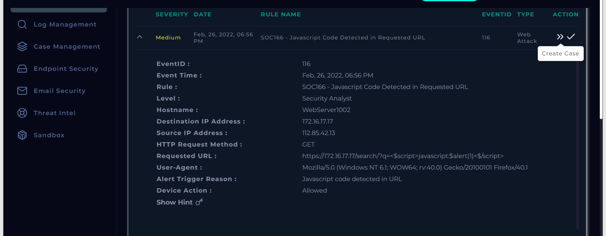
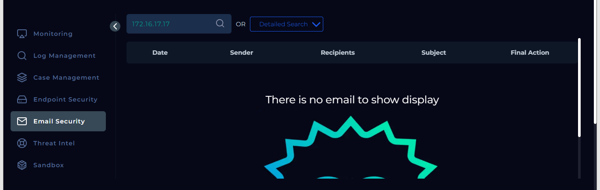
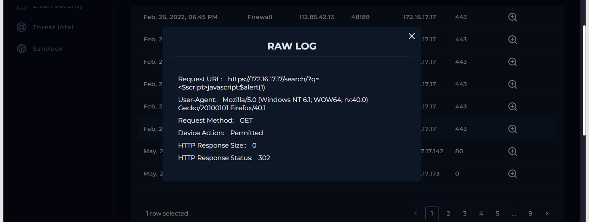

# SOC166 - XSS Attack Detection and Mitigation
## LETSDEFEND.IO SIEM

## Overview
This repository contains a case study from the **LetsDefend** platform, detailing the detection and analysis of a Cross-Site Scripting (XSS) attack attempt using the platform's **SIEM** and **SOC Events**. The malicious traffic was identified, and the attack was successfully blocked by security controls, preventing the execution of embedded JavaScript code in the requested URL.

---

## Event Summary
- **Event ID**: 116
- **Event Time**: Feb 26, 2022, 06:56 PM
- **Rule**: SOC166 - Javascript Code Detected in Requested URL
- **Platform**: LetsDefend SIEM & SOC Events
- **Attack Type**: Cross-Site Scripting (XSS)
- **Source IP**: `112.85.42.13` (Flagged as malicious external IP)
- **Destination IP**: `172.16.17.17` (Internal web server in the company network)
- **HTTP Response**: Status 302 (Redirection)
- **Outcome**: Attack blocked; the JavaScript code was not executed.

---

## Artifacts

| **Type**            | **Value**                                                                 | **Comment**                                         |
|---------------------|---------------------------------------------------------------------------|-----------------------------------------------------|
| **URL Address**      | `https://172.16.17.17/search/?q=<$script>javascript:$alert(1)<$/script>`  | Malicious URL containing JavaScript code            |
| **Source IP**        | `112.85.42.13`                                                            | Malicious external IP flagged by LetsDefend         |
| **Destination IP**   | `172.16.17.17`                                                            | Internal web server targeted by the XSS attack      |
| **MD5 Hash**         | N/A                                                                       | No specific file associated with this XSS event     |
| **Email Sender**     | N/A                                                                       | No related email communication found in analysis    |
| **Email Domain**     | N/A                                                                       | No domain related to email traffic                  |

---

## Screenshots

1. **Case Creation in LetsDefend**

This screenshot shows the creation of the case in LetsDefend SIEM for tracking the detected XSS attack event.

2. **No Email Communication for Destination IP**

This screenshot confirms that no email communication is associated with the destination IP `172.16.17.17`, indicating this was not a planned test attack.

3. **Log Management in LetsDefend - Attack Not Successful**

The screenshot from the LetsDefend SIEM Log Management shows that the XSS attack was unsuccessful. The HTTP Response Status is 302, meaning the request was redirected, and the response size is 0, confirming that the malicious JavaScript code was blocked.

---

## Analysis Comment

During this event, the LetsDefend SIEM detected malicious inbound traffic from source IP `112.85.42.13`, which attempted a Cross-Site Scripting (XSS) attack on an internal web server (`172.16.17.17`). The requested URL included JavaScript code aimed at executing an alert box (`<script>javascript:$alert(1)<script>`), which is a typical XSS payload.

Using the LetsDefend Log Management system, it was confirmed that the attack was blocked, with the response showing a status of 302 (redirection), and no damage or compromise occurred. There was no email communication associated with the destination IP, confirming this was not a test scenario.

While no further escalation is needed due to the attack being blocked, the vulnerability allowing the XSS attempt should be investigated and fixed. Input sanitization or other web security measures should be implemented to prevent future XSS attempts.

---

## Conclusion

This event, captured and analyzed using the LetsDefend platform, highlights a successful defense against an XSS attack targeting a company’s internal web server. The system effectively blocked the attempt, preventing JavaScript code execution. While no harm was done, it is recommended to address the XSS vulnerability to strengthen overall web security.
